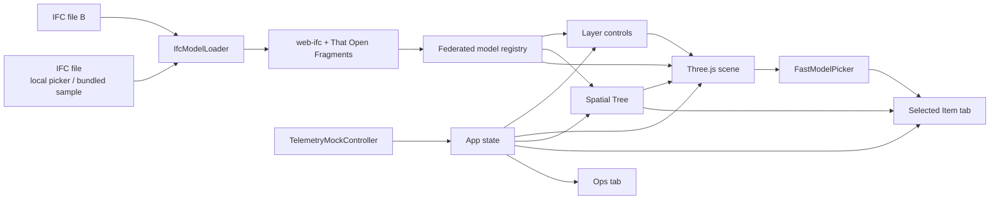

# Semiconductor Fab Digital Twin Platform

一個 `web-first` 的半導體數位孿生產品原型。  
這個 repo 的目標不是做單次展示用的 viewer，而是逐步建立一個可持續演進的產品核心，能把：

- `BIM 匯出檔 (IFC)`
- `3D viewer`
- `空間階層`
- `即時 telemetry`
- `營運型 dashboard`

整合成一個全廠可用的操作平台。

## Demo Preview

### Ops overview


### Selected item view


## What It Does

目前這個產品原型已經具備：

- `IFC-first` viewer：直接載入本機 IFC 或 bundled sample
- `Federated models`：可同時載入多個 IFC
- `Spatial Tree`：解析空間階層並顯示在 sidebar
- `3D <-> Tree` sync：點 3D 或點 tree 都能同步 selected item
- `Telemetry-driven coloring`：`normal / warning / alert` 直接改變整體 3D 顏色
- `Stream health`：`live / stale / disconnected / reconnecting`
- `Alert Summary`：依 category 聚合告警數量
- `Layer controls`：model/category 顯示開關、透明度、isolate、reset
- `Layer cache`：category layer 操作直接使用已解析的 model/category mapping，避免重複掃描 IFC
- `Selected Item KPI`：顯示 selected item 的即時指標
- `Last 30s trend`：selected item 的 utilization / temperature 小圖
- `One-screen tool UI`：tabbed sidebar + compact operations layout

## Why Web

這個產品刻意走 `web-first`，因為目標使用情境是營運型數位孿生，而不是大型桌面 CAD。

- Web 介面更符合跨部門共同查看、操作與分享
- `IFC + Three.js + WASM` 足以支撐 prototype 階段的 viewer 與監控流程
- 如果未來要支援離線、內網、原生裝置整合，再考慮 desktop packaging

## Stack

- `Vite`
- `TypeScript`
- `Three.js`
- `IFC / web-ifc`
- `That Open Components / Fragments`
- 原生 `CSS`
- 前端 mock telemetry stream

## Architecture



## Interaction Model

`Ops`
- 查看 stream 狀態
- 查看 live / normal / warning / alert 計數
- 查看 category alert summary
- 查看已載入模型數量
- 選擇本機 IFC 檔案

`Item`
- 查看 selected IFC item 的 `localId / GUID / category`
- 查看即時 power / utilization / temperature / pressure
- 查看最近 30 秒 utilization / temp 趨勢

`Tree`
- 查看空間樹
- 點擊節點同步 selected item
- 控制 model/category 顯示與透明度
- isolate / reset layers

## Run Locally

```bash
npm install
npm run dev
```

預設會啟在本機 `Vite` port，例如 `http://127.0.0.1:4173`。

正式檢查：

```bash
npm run build
```

## Controls

- 左鍵拖曳：旋轉視角
- 右鍵拖曳：平移
- 滾輪：縮放
- `Ops / Item / Tree` tab：切換資訊面板
- `Choose IFC file`：載入本機 IFC
- `Tree > Models`：控制多個 IFC model 的顯示、透明度與 isolate
- `Tree > Categories`：控制類別圖層的顯示、透明度、搜尋與 isolate

## Project Structure

- `src/app/scene/ifc-model-loader.ts`
  IFC 載入、federated model metadata、category mapping cache
- `src/app/scene/telemetry-mock-controller.ts`
  mock stream、狀態循環與每秒資料推送，支援多模型
- `src/app/scene/digital-twin-scene.ts`
  viewer、selection、federated model management、layer actions、telemetry coloring
- `src/app/state.ts`
  app state、model-scoped telemetry、layer state、history buffers、stream health
- `src/app/create-app-shell.ts`
  dashboard shell、tabs、ops/item/tree rendering、layer controls、SVG trend rendering
- `docs/assets/`
  README 截圖

## Product Principles

- `IFC` 是 BIM 交換入口，不只是幾何檔案來源
- telemetry 是第一級資料來源，直接驅動 3D 狀態、警示統計與 trend
- `Tree / 3D / selected item / layers` 必須彼此同步，不能各自孤立
- stream health 是產品資訊，不是背景細節
- UI 優先服務營運端，而不是 BIM author
- `one-screen, tabbed, operator-first` 是核心互動原則

## Current Scope

目前這是前端為主的產品核心，刻意暫時不做：

- 真正的後端 WebSocket server
- 帳號權限
- 歷史資料持久化
- 大型模型效能極限優化

## Product Roadmap

- `Model management`
  remove / rename / focus / save-view per model
- `Layer system`
  更完整的 category opacity、preset、filter summary
- `Operational telemetry backend`
  用真正的本機或內網 WebSocket service 取代 mock
- `Spatial aggregation`
  從 category summary 升級到 `space / zone / system`
- `Deployment`
  提供可分享的 staging URL 與部署流程
